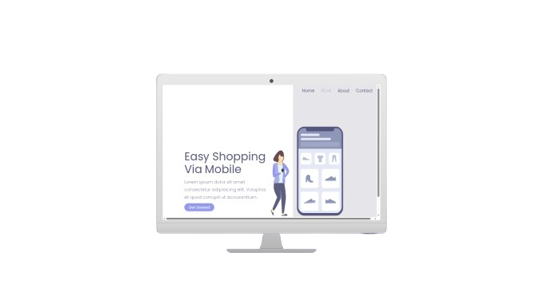
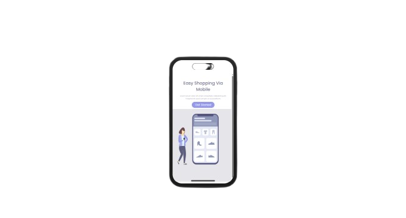
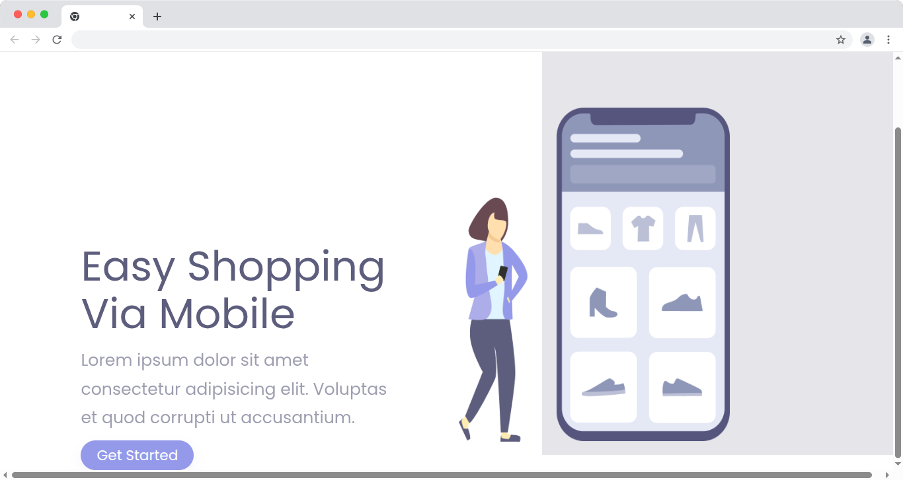

<div align="center">

# 🛍️ Easy Shopping Via Mobile

**Landing page moderna com foco em experiência mobile-first**

<p align="center">

| Desktop                                | Mobile                               |
| -------------------------------------- | ------------------------------------ |
|  |  |

</p>

<p align="center">
  <a href="#">
    
  </a>
  
  
</p>

<p align="center">
  <a href="#-sobre">Sobre</a> •
  <a href="#-features">Features</a> •
  <a href="#-tecnologias">Tecnologias</a> •
  <a href="#-estrutura">Estrutura</a> •
  <a href="#-autor">Autor</a>
</p>

</div>

---

## 📌 Sobre

O **Easy Shopping Via Mobile** é uma landing page moderna desenvolvida com foco total em **experiência mobile**, aplicando boas práticas de HTML semântico e CSS organizado.

O projeto simula uma interface de e-commerce simples, com layout limpo, navegação intuitiva e código bem estruturado — ideal para quem está consolidando fundamentos do desenvolvimento front-end.

> 💡 _Projeto desenvolvido com o objetivo de praticar estruturação de layouts responsivos e organização de código limpo._

---

## ✨ Features

| Funcionalidade           | Descrição                                            |
| ------------------------ | ---------------------------------------------------- |
| 📱 **Design Responsivo** | Adaptado para diferentes tamanhos de tela            |
| 🎯 **Foco em UX**        | Layout pensado para a experiência do usuário         |
| 🧱 **HTML Semântico**    | Uso correto de tags como `section`, `header`, `main` |
| 🎨 **CSS Moderno**       | Estilização organizada com classes reutilizáveis     |
| ⚡ **Leve e Rápido**     | Estrutura enxuta sem dependências externas           |

---

## 🖼️ Preview

<p align="center">
  
</p>

---

## 🧠 Aprendizados

Durante o desenvolvimento deste projeto, foram praticados:

- Estruturação de layouts com `div` e `section` de forma semântica
- Organização e escrita de código limpo e legível
- Criação e reutilização de classes CSS eficientes
- Separação clara de responsabilidades entre **HTML** (estrutura) e **CSS** (estilo)
- Boas práticas de desenvolvimento **mobile-first**

---

## 💻 Tecnologias

<div align="center">


| Tecnologia                                                                                | Uso                                  |
| ----------------------------------------------------------------------------------------- | ------------------------------------ |
|  | Estrutura e semântica da página      |
|     | Estilização, responsividade e layout |

</div>

---

## 📂 Estrutura

```
📁 easy-shopping-via-mobile
 ├── 📁 assets
 │    └── 🖼️ preview.png
 ├── 📄 index.html
 └── 🎨 styles.css
```

---

## 🚀 Deploy

O projeto está disponível online. Acesse pelo link abaixo:

<div align="center">

[](# "https://lincolnneres.github.io/Easy-Shopping/")

</div>

## 🧑‍💻 Autor

<div align="center">

Feito com ❤️ por **Lincoln**

[](https://linkedin.com/in/lincolnneres)

</div>

---

## 📄 Licença

Este projeto está sob a licença **MIT**. Veja o arquivo [LICENSE](./LICENSE) para mais detalhes.

---

<div align="center">

⭐ Se este projeto te ajudou de alguma forma, deixa uma estrela no repositório!

</div>
